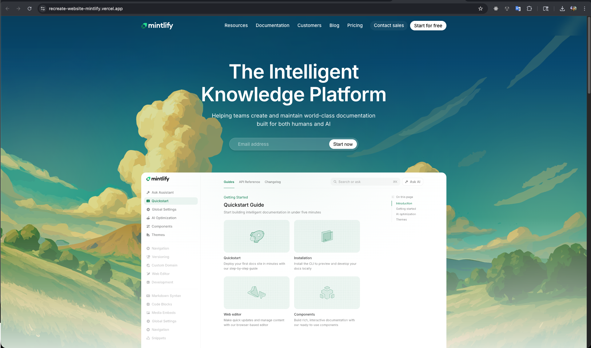
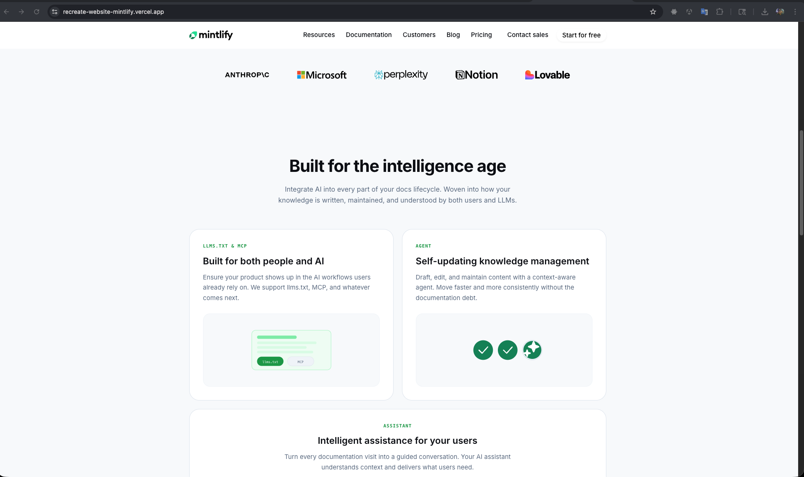
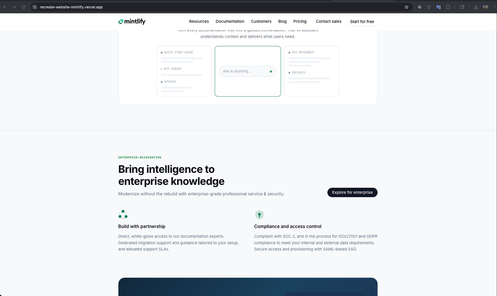
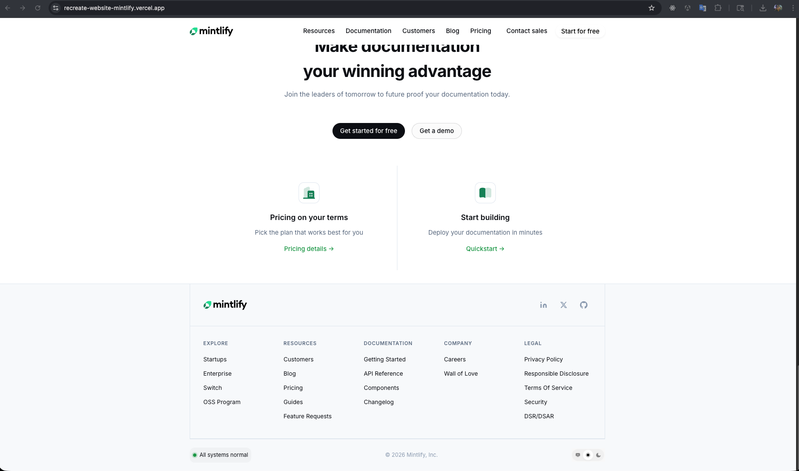

# Replicate Mintlify.com Home Page

## Deployment link:

https://recreate-website-mintlify.vercel.app/

## Fonts and color used

```css
--bg-color: #ffffff;
--bg-subtle: #f8fafc;
--bg-muted: #f1f5f9;
--text-primary: #080b13;
--text-secondary: #64748b;
--text-tertiary: #94a3b8;
--primary-color: #16a34a;
--primary-light: #dcfce7;
--border-color: #e2e8f0;
--border-subtle: #f1f5f9;
--font-sans:
  "Inter", system-ui, -apple-system, BlinkMacSystemFont, "Segoe UI", Roboto,
  Helvetica, Arial, sans-serif;
--font-mono: "SFMono-Regular", Consolas, "Liberation Mono", Menlo, monospace;
```

### fonts

```html
<link rel="preconnect" href="https://fonts.googleapis.com">
  <link rel="preconnect" href="https://fonts.gstatic.com" crossorigin>
  <link href="https://fonts.googleapis.com/css2?family=Inter:ital,wght@0,400;0,500;0,600;0,700;1,400&display=swap"
```

## Screenshot









